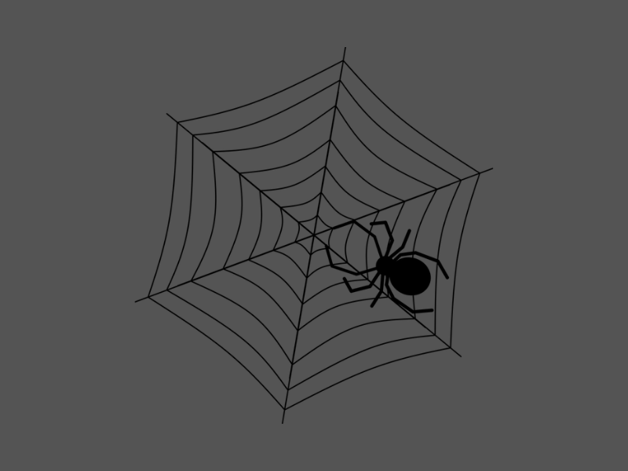
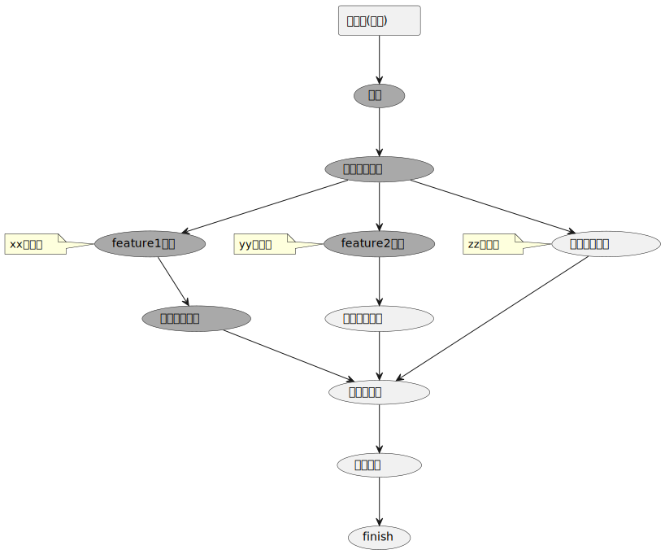
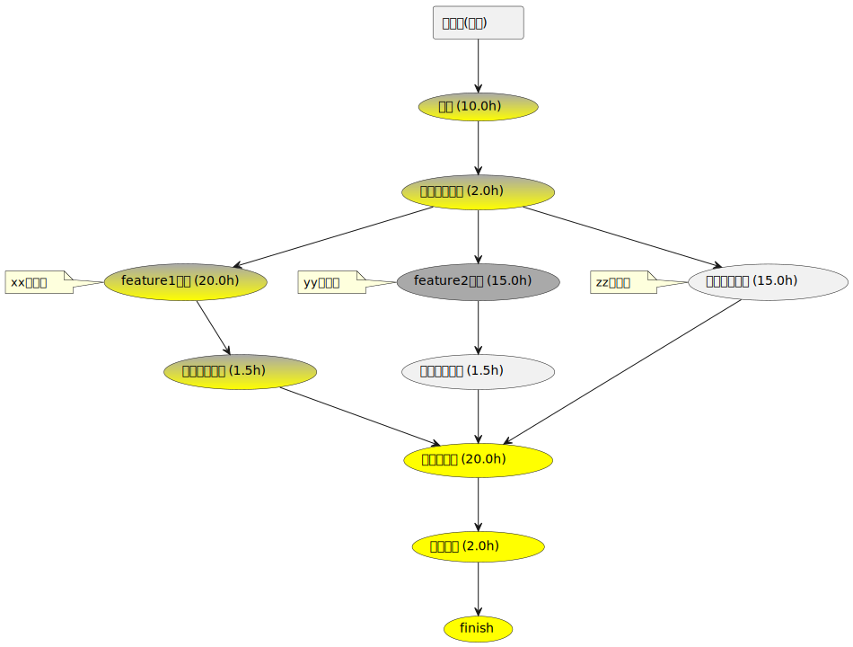
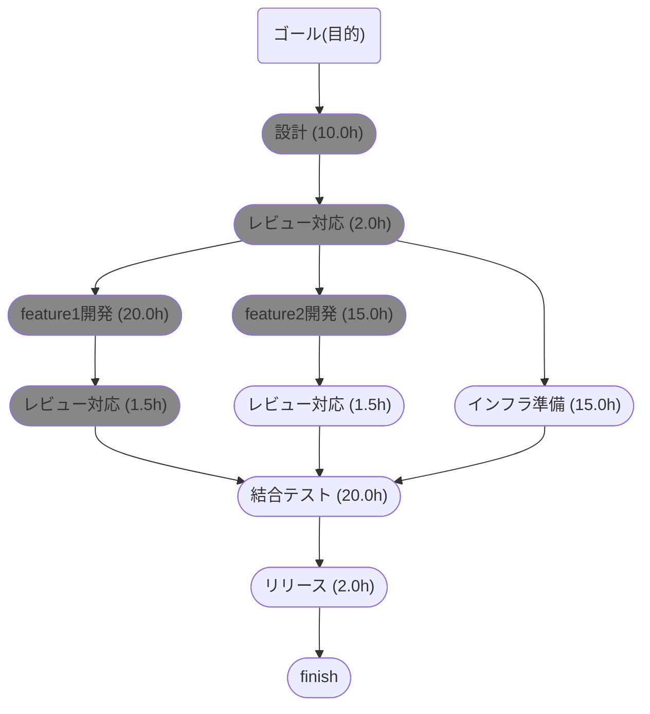
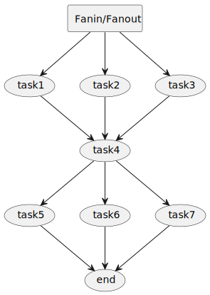

# gdag



Easily manage 🕸DAG🕷 with Go.<br>
DAG is an acronym for Directed Acyclic Graph.<br>
Output is in PlantUML or Mermaid format.<br>
Useful for progressing tasks, designing components, etc...

[](https://pkg.go.dev/github.com/ddddddO/gdag) [](https://github.com/ddddddO/gdag/releases) [](https://github.com/ddddddO/gdag/actions/workflows/ci.yaml) [](https://codecov.io/gh/ddddddO/gdag)

# Installation
```console
$ go get github.com/ddddddO/gdag
```

# Demo
## PlantUML

1. `go run main.go > dag.pu`

```go
package main

import (
	"fmt"
	"os"

	g "github.com/ddddddO/gdag"
)

func main() {
	var dag *g.Node = g.DAG("ゴール(目的)")

	var design *g.Node = g.Task("設計")
	reviewDesign := g.Task("レビュー対応")

	developFeature1 := g.Task("feature1開発")
	developFeature1.Note("xxが担当")
	reviewDevelopFeature1 := g.Task("レビュー対応")

	developFeature2 := g.Task("feature2開発")
	developFeature2.Note("yyが担当")
	reviewDevelopFeature2 := g.Task("レビュー対応")

	prepareInfra := g.Task("インフラ準備")
	prepareInfra.Note("zzが担当")

	test := g.Task("結合テスト")
	release := g.Task("リリース")
	finish := g.Task("finish")

	dag.Con(design).Con(reviewDesign).Con(developFeature1).Con(reviewDevelopFeature1).Con(test)
	reviewDesign.Con(developFeature2).Con(reviewDevelopFeature2).Con(test)
	reviewDesign.Con(prepareInfra).Con(test)
	test.Con(release).Con(finish)

	g.Done(design, reviewDesign, developFeature1, reviewDevelopFeature1, developFeature2)

	uml, err := dag.UML()
	if err != nil {
		fmt.Fprintln(os.Stderr, err)
		os.Exit(1)
	}
	fmt.Println(uml)
}
```

```
@startuml
rectangle "ゴール(目的)" as 1
usecase "設計" as 2 #DarkGray
usecase "レビュー対応" as 3 #DarkGray
usecase "feature1開発" as 4 #DarkGray
note left
xxが担当
end note
usecase "レビュー対応" as 5 #DarkGray
usecase "結合テスト" as 9
usecase "リリース" as 10
usecase "finish" as 11
usecase "feature2開発" as 6 #DarkGray
note left
yyが担当
end note
usecase "レビュー対応" as 7
usecase "インフラ準備" as 8
note left
zzが担当
end note

1 --> 2
2 --> 3
3 --> 4
4 --> 5
5 --> 9
9 --> 10
10 --> 11
3 --> 6
6 --> 7
7 --> 9
3 --> 8
8 --> 9

@enduml
```

2. dag.pu to png or svg



### Critical path

1. `go run main.go > dag.pu`

```go
package main

import (
	"fmt"
	"os"

	g "github.com/ddddddO/gdag"
)

func main() {
	var dag *g.Node = g.DAG("ゴール(目的)")

	var design *g.Node = g.Task("設計").Hour(10)
	reviewDesign := g.Task("レビュー対応").Hour(2)

	developFeature1 := g.Task("feature1開発").Hour(20)
	developFeature1.Note("xxが担当")
	reviewDevelopFeature1 := g.Task("レビュー対応").Hour(1.5)

	developFeature2 := g.Task("feature2開発").Hour(15)
	developFeature2.Note("yyが担当")
	reviewDevelopFeature2 := g.Task("レビュー対応").Hour(1.5)

	prepareInfra := g.Task("インフラ準備").Hour(15)
	prepareInfra.Note("zzが担当")

	test := g.Task("結合テスト").Hour(20)
	release := g.Task("リリース").Hour(2)
	finish := g.Task("finish")

	dag.Con(design).Con(reviewDesign).Con(developFeature1).Con(reviewDevelopFeature1).Con(test)
	reviewDesign.Con(developFeature2).Con(reviewDevelopFeature2).Con(test)
	reviewDesign.Con(prepareInfra).Con(test)
	test.Con(release).Con(finish)

	g.Done(design, reviewDesign, developFeature1, reviewDevelopFeature1, developFeature2)

	// If you do not want to represent critical path, use `dag.UMLNoCritical()`.
	uml, err := dag.UML()
	if err != nil {
		fmt.Fprintln(os.Stderr, err)
		os.Exit(1)
	}
	fmt.Println(uml)
}
```

```
@startuml
rectangle "ゴール(目的)" as 1
usecase "設計 (10.0h)" as 2 #DarkGray-Yellow
usecase "レビュー対応 (2.0h)" as 3 #DarkGray-Yellow
usecase "feature1開発 (20.0h)" as 4 #DarkGray-Yellow
note left
xxが担当
end note
usecase "レビュー対応 (1.5h)" as 5 #DarkGray-Yellow
usecase "結合テスト (20.0h)" as 9 #Yellow
usecase "リリース (2.0h)" as 10 #Yellow
usecase "finish" as 11 #Yellow
usecase "feature2開発 (15.0h)" as 6 #DarkGray
note left
yyが担当
end note
usecase "レビュー対応 (1.5h)" as 7
usecase "インフラ準備 (15.0h)" as 8
note left
zzが担当
end note

1 --> 2
2 --> 3
3 --> 4
4 --> 5
5 --> 9
9 --> 10
10 --> 11
3 --> 6
6 --> 7
7 --> 9
3 --> 8
8 --> 9

@enduml
```

2. dag.pu to png or svg


## Mermaid

※ Mermaid method does not support critical paths.

1. `go run main.go`

```go
package main

import (
	"fmt"
	"os"

	g "github.com/ddddddO/gdag"
)

func main() {
	var dag *g.Node = g.DAG("ゴール(目的)")

	var design *g.Node = g.Task("設計").Hour(10)
	reviewDesign := g.Task("レビュー対応").Hour(2)

	developFeature1 := g.Task("feature1開発").Hour(20)
	developFeature1.Note("xxが担当")
	reviewDevelopFeature1 := g.Task("レビュー対応").Hour(1.5)

	developFeature2 := g.Task("feature2開発").Hour(15)
	developFeature2.Note("yyが担当")
	reviewDevelopFeature2 := g.Task("レビュー対応").Hour(1.5)

	prepareInfra := g.Task("インフラ準備").Hour(15)
	prepareInfra.Note("zzが担当")

	test := g.Task("結合テスト").Hour(20)
	release := g.Task("リリース").Hour(2)
	finish := g.Task("finish")

	dag.Con(design).Con(reviewDesign).Con(developFeature1).Con(reviewDevelopFeature1).Con(test)
	reviewDesign.Con(developFeature2).Con(reviewDevelopFeature2).Con(test)
	reviewDesign.Con(prepareInfra).Con(test)
	test.Con(release).Con(finish)

	g.Done(design, reviewDesign, developFeature1, reviewDevelopFeature1, developFeature2)

	mermaid, err := dag.Mermaid()
	if err != nil {
		fmt.Fprintln(os.Stderr, err)
		os.Exit(1)
	}
	fmt.Println(mermaid)
}
```

```
graph TD
classDef doneColor fill:#868787
1("ゴール(目的)")
2(["設計 (10.0h)"]):::doneColor
3(["レビュー対応 (2.0h)"]):::doneColor
4(["feature1開発 (20.0h)"]):::doneColor
5(["レビュー対応 (1.5h)"]):::doneColor
9(["結合テスト (20.0h)"])
10(["リリース (2.0h)"])
11(["finish"])
6(["feature2開発 (15.0h)"]):::doneColor
7(["レビュー対応 (1.5h)"])
8(["インフラ準備 (15.0h)"])

1 --> 2
2 --> 3
3 --> 4
4 --> 5
5 --> 9
9 --> 10
10 --> 11
3 --> 6
6 --> 7
7 --> 9
3 --> 8
8 --> 9
```

2. rendering



## CheckList

1. `go run main.go`

```go
package main

import (
	"fmt"
	"os"

	g "github.com/ddddddO/gdag"
)

func main() {
	dag := g.DAG("ゴール(目的)")

	design := g.Task("設計")
	reviewDesign := g.Task("レビュー対応")

	developFeature1 := g.Task("feature1開発")
	developFeature1.Note("xxが担当")
	reviewDevelopFeature1 := g.Task("レビュー対応")

	developFeature2 := g.Task("feature2開発")
	developFeature2.Note("yyが担当")
	reviewDevelopFeature2 := g.Task("レビュー対応")

	prepareInfra := g.Task("インフラ準備")
	prepareInfra.Note("zzが担当")

	test := g.Task("結合テスト")
	release := g.Task("リリース")
	finish := g.Task("finish")

	dag.Con(design).Con(reviewDesign).Con(developFeature1).Con(reviewDevelopFeature1).Con(test)
	reviewDesign.Con(developFeature2).Con(reviewDevelopFeature2).Con(test)
	reviewDesign.Con(prepareInfra).Con(test)
	test.Con(release).Con(finish)

	g.Done(design, reviewDesign, developFeature2, finish)

	checkList, err := dag.CheckList()
	if err != nil {
		fmt.Fprintln(os.Stderr, err)
		os.Exit(1)
	}
	fmt.Println(checkList)
}
```

```
### ゴール(目的)
- [x] 設計
- [x] レビュー対応
- [ ] feature1開発
- [ ] レビュー対応
- [x] feature2開発
- [ ] レビュー対応
- [ ] インフラ準備
- [ ] 結合テスト
- [ ] リリース
- [x] finish
```

2. share with members
### ゴール(目的)
- [x] 設計
- [x] レビュー対応
- [ ] feature1開発
- [ ] レビュー対応
- [x] feature2開発
- [ ] レビュー対応
- [ ] インフラ準備
- [ ] 結合テスト
- [ ] リリース
- [x] finish

## Miscellaneous

### FanIn/FanOut

1. Fanin/Fanout func usage
	```go
	package main

	import (
		"fmt"
		"os"

		g "github.com/ddddddO/gdag"
	)

	func main() {
		dag := g.DAG("Fanin/Fanout")
		dag.Fanout(
			g.Task("t1"), g.Task("t2"),
		).Fanin(
			g.Task("t3"),
		).Fanout(
			g.Task("t4"), g.Task("t5"), g.Task("t6"), g.Task("t7"),
		).Fanin(
			g.Task("t8"),
		).Con(
			g.Task("t9"),
		).Fanout(
			g.Task("t10"), g.Task("t11"),
		).Fanin(
			g.Task("end"),
		)
		uml, err := dag.UML()
		if err != nil {
			fmt.Fprintln(os.Stderr, err)
			os.Exit(1)
		}
		fmt.Println(uml)
	}
	```

2. Result

	

### short name methods

```go
package main

import (
	"fmt"
	"os"

	g "github.com/ddddddO/gdag"
)

func main() {
	var dag *g.Node = g.DAG("ゴール(目的)")

	var design *g.Node = g.T("設計")
	reviewDesign := g.T("レビュー対応")

	developFeature1 := g.T("feature1開発")
	developFeature1.N("xxが担当")
	reviewDevelopFeature1 := g.T("レビュー対応")

	developFeature2 := g.T("feature2開発").N("yyが担当")
	reviewDevelopFeature2 := g.T("レビュー対応")

	prepareInfra := g.T("インフラ準備").N("zzが担当")

	test := g.T("結合テスト")
	release := g.T("リリース")
	finish := g.T("finish")

	dag.C(design).C(reviewDesign).C(developFeature1).C(reviewDevelopFeature1).C(test)
	reviewDesign.C(developFeature2).C(reviewDevelopFeature2).C(test)
	reviewDesign.C(prepareInfra).C(test)
	test.C(release).C(finish)

	g.D(design, reviewDesign, developFeature2, finish)

	uml, err := dag.UML()
	if err != nil {
		fmt.Fprintln(os.Stderr, err)
		os.Exit(1)
	}
	fmt.Println(uml)
}
```

### Ginger grilled pork recipe (and more)


### Component design


- 「Clean Architecture 達人に学ぶソフトウェアの構造と設計」P131 図14-4 より

# Reference
- [about DAG](https://nave-kazu.hatenablog.com/entry/2015/11/30/154810)
- [タスクの鳥瞰図を楽に(?)管理する](https://zenn.dev/openlogi/articles/a8edae5e9eb884)

# Stargazers over time
[](https://starchart.cc/ddddddO/gdag)
